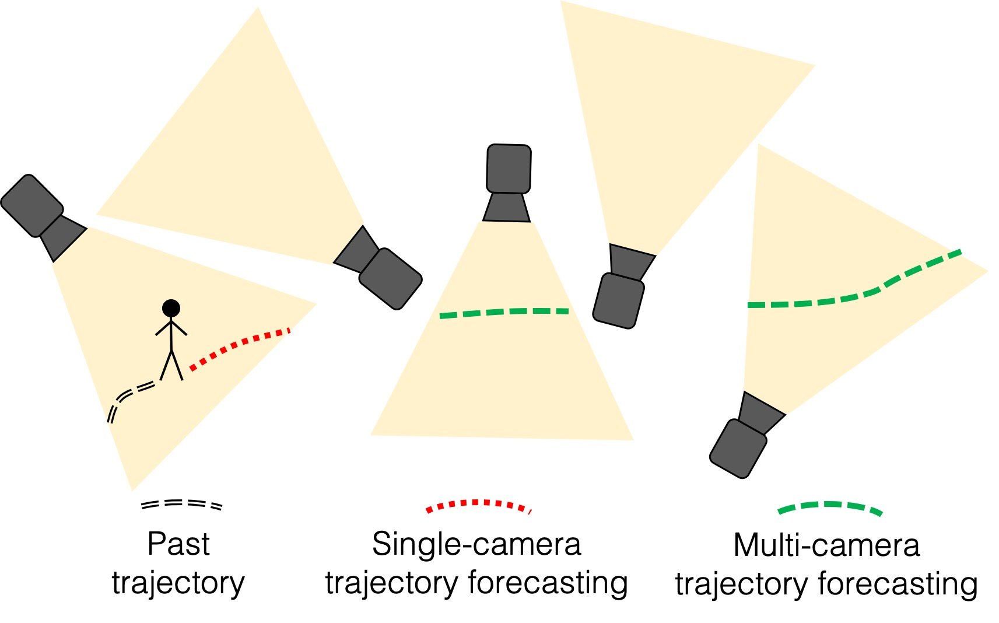
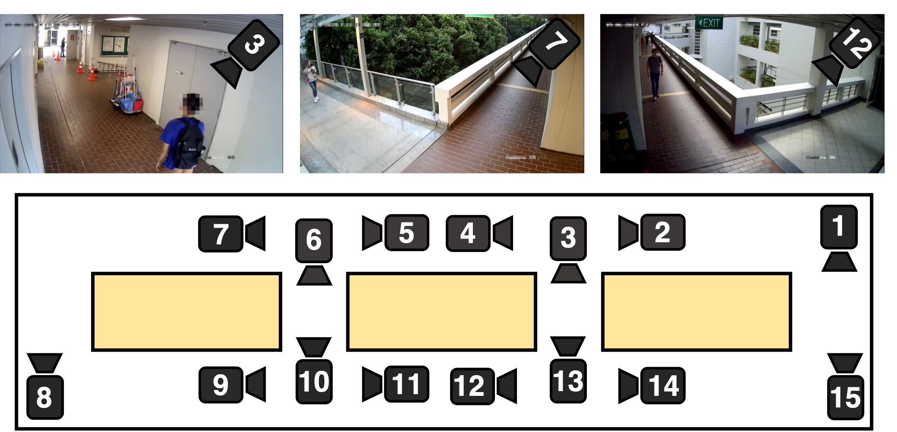

# Multi-Camera-Trajectory-Forecasting

This repo contains information on the Warwick-NTU Multi-camera Forecasting database (WNMF) and baseline multi-camera trajectory forecasting (MCTF) experiments. This repo acompanies the following paper:

Olly Styles, Tanaya Guha, Victor Sanchez, Alex C. Kot, “Multi-Camera Trajectory Forecasting: Pedestrian Trajectory Prediction in a Network of Cameras”, IEEE Conference on Computer Vision and Pattern Recognition Workshops, 2020

 

## Accessing WNMF
If you are interested in downloading the WNMF dataset, please download a copy of our [[Release Agreement](https://github.com/olly-styles/Multi-Camera-Trajectory-Forecasting/blob/master/WNMF%20release%20agreement.pdf)]. After reading the terms, fill in the information and send the completed agreement to the email address shown in the document. We will then send you the link and password to access the dataset.

## Dataset details

The data download contains the following:

##### Videos
Videos are paired into entrances and departures. A departure is defined as the 4 seconds before tracking infromation is lost (and the person is therefore assumed to have left the camera view. An entrance is the next camera of re-apperance for this individual. Entrance video clips last for 12 seconds, starting from the moment the individual departed from the other camera view. Each video is processed using [[RetinaFace](https://arxiv.org/abs/1905.00641)] using an open-source [[Pytorch implementation](https://github.com/biubug6/Pytorch_Retinaface)] to mask faces.
##### Bounding boxes
Bouding boxes are obtained using an [[open-source implementation](https://github.com/matterport/Mask_RCNN)] of [[Mask-RCNN](https://arxiv.org/abs/1703.06870)], pre-trained on [[MS-COCO](https://link.springer.com/chapter/10.1007/978-3-319-10602-1_48)]. Individuals are then tracked using an [[open-source implementation](https://github.com/Qidian213/deep_sort_yolov3)] of the [[DeepSORT](https://arxiv.org/abs/1703.07402)] tracking algorithm.
##### Entrances and departures
Each track is labelled as as entrance (first frame of the track) or departure (last frame of the track)
##### RE-ID features
RE-ID features are computed using an [[open-source implementation](https://github.com/michuanhaohao/reid-strong-baseline)] of the [[bag-of-tricks](https://arxiv.org/abs/1903.07071)] RE-ID model pretrained on [[Market-1501](https://ieeexplore.ieee.org/document/7410490/)].
##### Cross-camera matches
Cross-camera matches are found using the labelling procedure described in our paper.
##### Models
Pre-trained weights for each model in our paper.
##### Camera topology
The camera topology is shown in the figure below.

 
  

